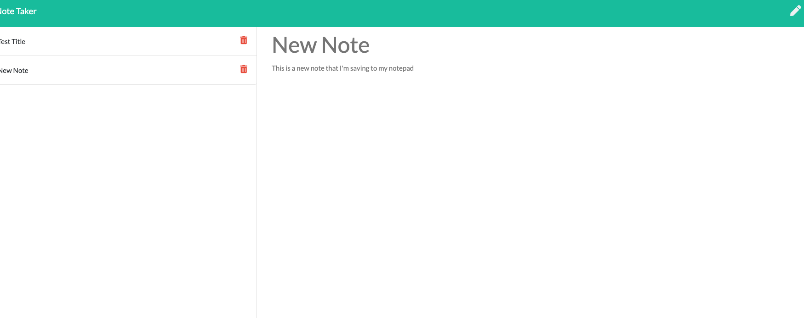

<h1 align="center">Unit 11 Express Homework: Note Taker</h1>

## Table of Contents

- [Description](#description)
- [Installation](#installation)
- [Usage](#usage)
- [Contributing](#contributing)
- [Questions](#questions)

## Description

This is an application that can be used to write, save, and delete notes. This application uses an express backend to save and retrieve note data from a JSON file.  HTML & API routes were created to GET & POST data utilizing the fs module.  The application was deployed on Heroku and can be viewed at https://nameless-citadel-09679.herokuapp.com/. 

Gif showing the functionality of the application:

The full movie file showing functionality of the application can be found [here](./src/te.mp4)

Screenshot of the completed output:

## Installation

`npm init`

`npm install express`

## Usage

Visit the live website deployed on Heroku here => https://nameless-citadel-09679.herokuapp.com/. 

## Contributing

:octocat: [Doug Kvamme](https://github.com/kvadou)

## Questions

Contact me with any questions: [email](mailto:dougkvamme@gmail.com) , [GitHub](https://github.com/kvadou) 
